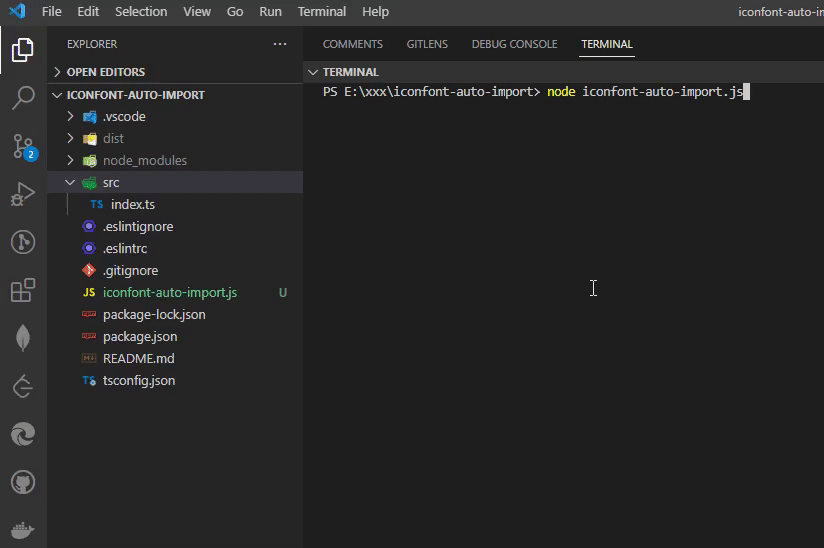

# iconfont-auto-import

基于puppeteer自动导入阿里巴巴矢量库的项目图标。iconfont.cn



## Install
```
npm install iconfont-auto-import -D
```

## Usage

### 基本用法

- 第一步：安装 iconfont-auto-import 插件；
- 第二步：在你的项目代码根目录下，创建一个 iconfont-auto-import.js 文件；
- 第三步：参照示例代码配置好参数，在命令行执行 node iconfont-auto-import.js，即可自动导入阿里巴巴矢量库图标文件。

```javascript
// iconfont-auto-import.js
const IconfontAutoImport = require('iconfont-auto-import').default;
const path = require('path');

const app = new IconfontAutoImport({
  username: 'your username', // 阿里巴巴矢量库登录账号
  password: 'your password', // 阿里巴巴矢量库登录密码
  projectId: 'your projectId', // 项目id
  basePath: path.resolve('src/static'),
  iconfontFolder: 'iconfont', // /src/static/iconfont
});

app.start();
```
ps: 每次导入新的图标会将原有的 iconfontFolder 指定的文件夹移除

projectId（图标项目的id）获取方式：打开阿里巴巴矢量库->资源管理->我的项目->打开对应的图标项目->浏览器上的url参数中有projectId=XXXX。

如果你想将下载的图标资源放置到指定位置，你可以跟示例代码一样设置 bashPath 和 iconfontFolder，如果不设置这两个字段，默认下载的的图标资源放置在项目根目录下的iconfont文件里。

### 设置保留文件

下载下来的图标资源，可能存在一些你用不到的图标文件。那么你可以通过设置 retainFileList，只保留你想要的图标资源文件。例如下面代码所示

```javascript
// iconfont-auto-import.js
const IconfontAutoImport = require('iconfont-auto-import').default;

const app = new IconfontAutoImport({
  ...,
  retainFileList: [
    'iconfont.css',
    'iconfont.svg',
    'iconfont.ttf',
    'iconfont.woff',
    'iconfont.woff2'
  ]
});

app.start();
```

### 修改文件内容

如果你想对图标资源的文件内容进行修改，那么使用 modifyFileList。数组元素对象有两个属性 fileName 和 update。fileName指定文件名，update 函数接受一个参数 content, content 为文件内容字符串。可以通过正则表达式等方式对 content 进行修改并返回。

```javascript
// iconfont-auto-import.js
const IconfontAutoImport = require('iconfont-auto-import').default;

const app = new IconfontAutoImport({
  ...,
  modifyFileList: [
    {
      fileName: 'iconfont.css',
      update: (content) => {
        return '/* 测试一下 */' + content;
      }
    }
  ]
});

app.start();
```

### 保留图标压缩包

如果你想得到图标资源的压缩包，将 saveCompressedPackage 字段设置为 true，会将下载到的 download.zip 图标资源压缩包放在跟 iconfont-auto-import.js 文件的目录同级。也可以通过 compressedPackagePath 和 compressedPackageFileName 字段配置，将压缩包重命名文件，并放到指定位置。

```javascript
// iconfont-auto-import.js
const IconfontAutoImport = require('iconfont-auto-import').default;
const path = require('path');

const app = new IconfontAutoImport({
  ...,
  saveCompressedPackage: true,
  compressedPackagePath: path.join(__dirname, 'static'),
  compressedPackageFileName: 'download'
});

app.start();
```

### 配置puppeteer

因为 iconfont-auto-import 插件使用到了 puppeteer 插件，可以通过 puppeteerOptions 字段可以配置 puppeteer。

想知道更多puppeteer配置，请参考官方文档：http://www.puppeteerjs.com/#?product=Puppeteer&version=v15.4.0

```javascript
// iconfont-auto-import.js
const IconfontAutoImport = require('iconfont-auto-import').default;

const app = new IconfontAutoImport({
  ...,
  puppeteerOptions: {
    headless: false // 关闭无头
  }
});

app.start();
```

## Git Contribution submission specification

> reference [vue](https://github.com/vuejs/vue/blob/dev/.github/COMMIT_CONVENTION.md) specification ([Angular](https://github.com/conventional-changelog/conventional-changelog/tree/master/packages/conventional-changelog-angular))

- `feat` Add new features
- `fix` Fix the problem/BUG
- `style` The code style is related and does not affect the running result
- `perf` Optimization/performance improvement
- `refactor` Refactor
- `revert` Undo edit
- `test` Test related
- `docs` Documentation/notes
- `chore` Dependency update/scaffolding configuration modification etc.
- `workflow` Workflow improvements
- `ci` Continuous integration
- `types` Type definition file changes
- `wip` In development

## License

[MIT](./LICENSE) License &copy; 2022-PRESENT [德鲁叔叔](https://github.com/chenjiezi)